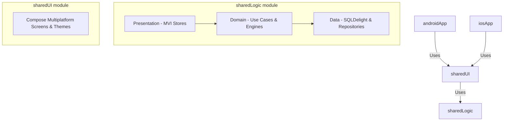

# 💧 HydroHabit — Kotlin Multiplatform Hydration Tracker

**HydroHabit** is a modern, cross-platform hydration tracking application designed to help users build and sustain healthy water-intake habits. Built using **Kotlin Multiplatform (KMP)** and **Compose Multiplatform**, it shares 100% of its business logic, data database layers, and UI presentation components across **Android** and **iOS**.

---

## 🚀 Key Features

* **Dynamic Goal Calculation**: Automatically calculates personalized daily hydration goals based on weight, age, gender, and activity levels.
* **MVI UI Architecture**: Implements a clean, unidirectional Model-View-Intent (MVI) pattern using platform-agnostic `MviStore` (driven by Kotlin Coroutines & Flow).
* **Intake Logging & History**: Quick-add presets (e.g., 250ml, 500ml) or custom logs with interactive calendar and history lists.
* **Gamification & Achievements**: Tracks daily and weekly streaks, and dynamically unlocks badges (e.g., *First Sip*, *7-Day Streak*, *Century Club*, *Hydration Master*).
* **Smart Reminders**: Dynamically schedules push notifications/reminders inside user-defined awake hours.
* **Interactive Statistics**: Computes weekly/monthly hydration analytics and goal completion trends.

---

## 🛠️ Architecture & Tech Stack

The project follows a clean, layered architecture separating core business rules, database persistence, and presentation code from platform-specific UI bindings.



### Tech Stack Details:
* **Core Language**: Kotlin 2.x
* **UI Framework**: Compose Multiplatform (sharing screens, theme, and custom composables like `WaterRing` between platforms)
* **Database Persistence**: SQLDelight (type-safe SQLite database generation with native platform drivers)
* **Dependency Injection**: Koin (Koin Core + Koin Android)
* **Asynchronous Flow**: Kotlin Coroutines & Flow for reactive state streaming
* **Date & Time Management**: `kotlinx-datetime` for robust timezone and period logic

---

## 📂 Project Structure

* **`androidApp/`**: Android application wrapper. Bootstraps the application, configures Koin injection, and sets up `MainActivity`.
* **`iosApp/`**: iOS application entry point built with SwiftUI. Hooks up the `App` component within SwiftUI view hosting.
* **`sharedUI/`**: The shared Compose UI layer. Contains:
  * Unified theme colors, typography, and styling components (`com.bose.hydrohabit.theme`).
  * Custom widgets (e.g., interactive SVG/canvas `WaterRing`).
  * Screen layouts (`HomeScreen`, `HistoryScreen`, `AnalyticsScreen`, `AchievementsScreen`, `SettingsScreen`).
* **`sharedLogic/`**: Shared business logic, database queries, and MVI stores:
  * `domain/engine`: Pure, unit-tested calculators (`HydrationGoalCalculator`, `ReminderScheduler`, `AchievementEvaluator`, `StreakCalculator`).
  * `domain/usecase`: Encapsulated domain scenarios (e.g. `ObserveDailyProgressUseCase`, `AddWaterEntry`).
  * `presentation`: Unidirectional state-management stores implementing `MviStore` for each screen.
  * `sqldelight`: SQLite database schema files (`Achievement.sq`, `WaterEntry.sq`, etc.) compiled into Kotlin query APIs.

---

## ⚙️ Running the Apps

Ensure you have Android Studio (Ladybug or later) and Xcode (for iOS) installed.

### Android
To compile and assemble the debug Android package:
```bash
./gradlew :androidApp:assembleDebug
```
You can also launch it on an emulator or a connected device directly from Android Studio using the preconfigured `androidApp` run configuration.

### iOS
1. Open the terminal and compile the shared logic framework:
   ```bash
   ./gradlew :sharedLogic:embedAndSignAppleFrameworkForXcode
   ```
2. Open the `/iosApp` directory in Xcode.
3. Select an iOS simulator or device and press **Run (⌘R)**.

---

## 🧪 Running Unit Tests
Shared logic, domain use cases, and calculation engines are heavily unit-tested. You can execute all tests via Gradle:
```bash
./gradlew :sharedLogic:test
```
or run Android host tests:
```bash
./gradlew :sharedLogic:testAndroidHost
```